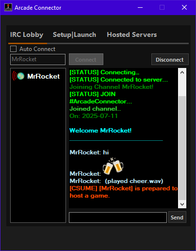
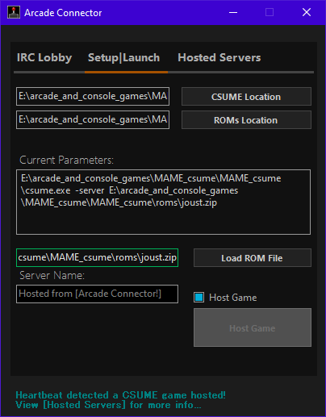
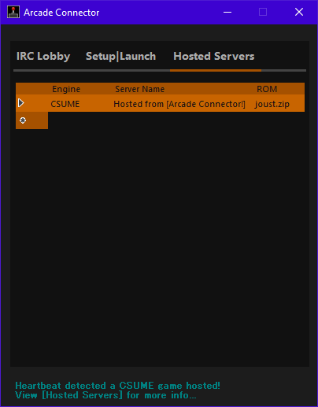

# 🎮 Arcade Connector — An Arcade Game Launcher

**Arcade Connector** is a modern Windows launcher built specifically for **C.S.U.M.E.**  
But what is CSUME? It's a **Client/Server Universal Machine Emulator** — a MAME variant called **UME**, adapted for client/server multiplayer. With CSUME, users can **host and join multiplayer arcade games** in real time.

Arcade Connector provides a rich front-end experience with features like IRC chat integration, autojoin, profile icons, hosted game detection, and more.

> **“Connect. Chat. Host. Play.”**

---

## ✅ Features

- Lightweight IRC client with user list and status icons  
- Host CSUME games with automatic ROM broadcasting  
- Auto-join games via "Ready Up" toggle  
- Clickable `join://` chat links for instant connection  
- Host and player detection via UDP heartbeat (doesn’t rely on IRC)  
- Profile picture support  
- Inline images and sound cues in chat (`/beer`, `/snooze`, `/sound cheer`)  
- Smart join filtering (prevents joining while already in-game)  
- Status-aware icons: online, afk, ingame, ready, moderator  

---

## 🛠 Getting Started

### ✅ Requirements

- **Windows 7 / 10 / 11**
- **.NET Framework 4.5+**  
  [Download .NET 4.5](https://www.microsoft.com/en-us/download/details.aspx?id=30653)  
  [Offline Installer](https://www.microsoft.com/en-us/download/details.aspx?id=30653)
- **CSUME executable** (not included)  
- **ROM files** placed in the configured ROMs folder  
  ⚠️ *Arcade Connector does not and will not provide ROM files. Users must supply their own.*
- **Minimum hardware**: Dual-core CPU, 1GB RAM, Direct3D-capable GPU  
- **Internet or LAN connection**  
  *(Offline gameplay still works, but hosting and joining require a network)*

---

## 🚀 How to Use

1. Launch the app  
2. Enter a nickname and connect to IRC  
3. Right-click a user to **“Ready Up”** for autojoin  
4. Click **Host Game** to start a CSUME server with a selected ROM  
5. Use the integrated chat to communicate  
6. When you return from the game, your **status and icon** update automatically  

---

## 📦 Third-Party Libraries / Credits

- **CSUME by MisterTea** (originally part of MAMEHub)  
  > CSUME is a fork of UME with client/server support. This launcher includes a CSUME binary compiled separately.  
  - [CSUME / MAMEHub Attribution](docs/licenses/LICENSE_CSUME.txt)

- **MetroFramework UI** — modern WinForms components  
  - Source: [MetroFramework GitHub](https://github.com/thielj/MetroFramework)  
  - [MetroFramework (MIT)](docs/licenses/LICENSE_MetroFramework.txt)

- **SmartIRC4Net by Meebey** — IRC library for .NET  
  - Source: [SmartIRC4Net GitHub](https://github.com/meebey/SmartIrc4net)  
  - [SmartIRC4Net (GPLv2)](docs/licenses/LICENSE_SmartIRC4Net.txt)

- **System.Media.SoundPlayer** — built-in .NET sound API  
- **Windows Forms** — native WinForms UI  
- **.NET Framework 4.5+**

> 💡 If you distribute a compiled version, include all applicable license files (e.g., MIT for MetroFramework, GPLv2 for SmartIRC4Net).

---

## 🔧 Build Instructions

1. Open the solution in **Visual Studio 2017 or later**  
2. Set `Form1.cs` (or your custom form) as the startup form  
3. Build and run  
4. Ensure that the `Sounds/` and `Images/` folders exist and contain the required media files  

---

## 🤝 Contribution

This project is still early-stage and focused. Pull requests are welcome for:

- UI and UX improvements  
- CSUME integration enhancements  
- Visual polish (profile icons, animations, etc.)

---

## 📄 License

This launcher is open-source and distributed under the [MIT License](LICENSE.md).

---

### 🔌 CSUME Notice

**CSUME (Client/Server Universal Machine Emulator)**  
Forked from UME (Universal Machine Emulator) by MisterTea — [GitHub: MAMEHub](https://github.com/MisterTea/MAMEHub)  
CSUME is derived from the MAME project and follows a BSD-like license.  

> See [`LICENSE_CSUME.txt`](bin/docs/licenses/LICENSE_CSUME.txt) for full details.
